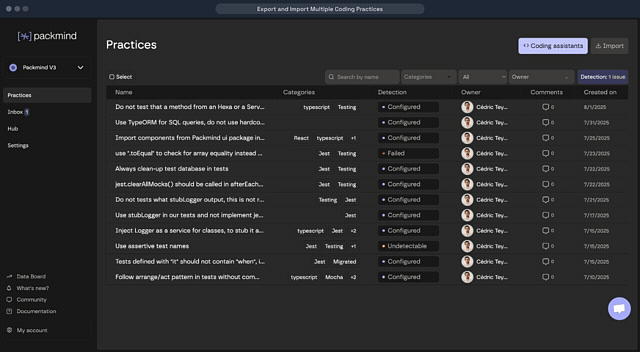

# Packmind Legacy Import

A migration tool to convert coding practices from the legacy Packmind format to the new standards-based format in Packmind AI.

## Prerequisites

- [Bun](https://bun.sh/) runtime (recommended) or Node.js 22.17.0+

## Environment Setup

Create a `.env` file at the root of the project with the following variables:

```env
# Required for --map and --get-spaces commands
# Your API key from the legacy Packmind instance
# Available from your current Packmind organization at `https://<orga_name>.packmind.app` (or from your self-hosted instance)
SOURCE_PACKMIND_API_KEY=your_legacy_packmind_api_key

# Required for --map command (LLM-based categorization)
OPENAI_API_KEY=your_openai_api_key

# Optional: OpenAI model to use (default: gpt-5.1)
OPENAI_MODEL=gpt-5.1

# Required for --import command
# Your API key from the new Packmind instance (https://app.packmind.ai if on Cloud, or your custom self-hosted instance)
PACKMIND_V3_API_KEY=your_packmind_v3_api_key
```

## Migration Workflow

### Step 1: Retrieve the `.jsonl` files

Export your practices from your current Packmind organization:
- Go to `https://<orga_name>.packmind.app` (or your self-hosted instance)
- Export your practices as `.jsonl` files 



Place these `.jsonl` files in the `res/` directory. You don't need to give any particular name to these files — the tool will automatically discover and process all `.jsonl` files in the folder.

### Step 2: Run the `--map` command

```bash
bun run dev -- --map
```

This command will:
1. Load all `.jsonl` files from the `res/` directory
2. Fetch space information from your legacy Packmind instance
3. Generate `{space-slug}.standards-mapping.yaml` and `{space-slug}.standards-validation.json` files

Each output file is prefixed with the name of the Packmind space that contained the practices.

The tool uses an LLM to propose a distribution of practices into one or more standards. The goal is to create more granular, focused standards compared to the original Packmind spaces.

### Step 3: Review and edit the mapping files

Open the generated `.standards-mapping.yaml` files and review the proposed organization. You can:

- **Rename standards**: Change the name of any proposed standard
- **Redistribute practices**: Move practices between standards
- **Create new standards**: Add new standard groups as needed
- **Remove practices**: If you delete a practice from the file, it will not be imported into the new Packmind instance

Take your time to organize your standards in a way that makes sense for your team.

### Step 4: Run the `--import` command

When you're ready to import, run:

```bash
bun run dev -- --import
```

This command will:
1. Scan the `res/` directory for `.standards-validation.json` files
2. Display a list of discovered files with their standards and rules count
3. Prompt you to select which files to import (enter numbers like "1,3" or press Enter for all)
4. Ask for confirmation before importing
5. Import the selected standards to Packmind

```bash
# Import only the first standard from each file (useful for testing)
bun run dev -- --import --one
```

## Key Concepts

### Practices → Rules in Standards

The fundamental mapping in this migration is:

| Legacy Packmind | Packmind |
|-----------------|-------------|
| Practice | Rule |
| Space | Standard(s) |

A single **practice** in the legacy format becomes a **rule** within a **standard** in the new Packmind.

The goal of this migration is not just to convert practices to rules, but to **group them into meaningful, focused standards** that are more granular than the original spaces.

### Detection Programs

Detection programs from legacy practices are preserved **only** when:
- The practice was configured to be detectable
- The practice had an active detection program

If these conditions are not met, the detection program is not imported. You can always regenerate detection programs later using Packmind's linter feature.

## Command Reference

| Command | Description |
|---------|-------------|
| `--map` | Run full pipeline: fetch spaces → process JSONL → generate mappings |
| `--import` | Interactively select and import validation files to Packmind V3 |
| `--import --one` | Import only the first standard from each selected file |
| `--get-spaces` | Fetch spaces from Packmind API (debug) |
| `--init` | Process JSONL files only (debug) |
| `--stats` | Display practice statistics |
| `--help` | Show help message |

## Development

```bash
# Install dependencies
bun install

# Run in development mode
bun run dev -- --help

# Build the binary
bun run build

# Run tests
bun test
```

## Important: Keep Your Files

We recommend keeping all generated files locally after the migration is complete:

- `.jsonl` files (original exported practices)
- `.yaml` and `.minified.yaml` files (intermediate formats)
- `.standards-mapping.yaml` files (your curated organization)
- `.standards-validation.json` files (final import data)

These files serve as a backup and audit trail of your migration. They can be useful if you need to re-import, troubleshoot issues, or reference the original practice data in the future.

## License

ISC

